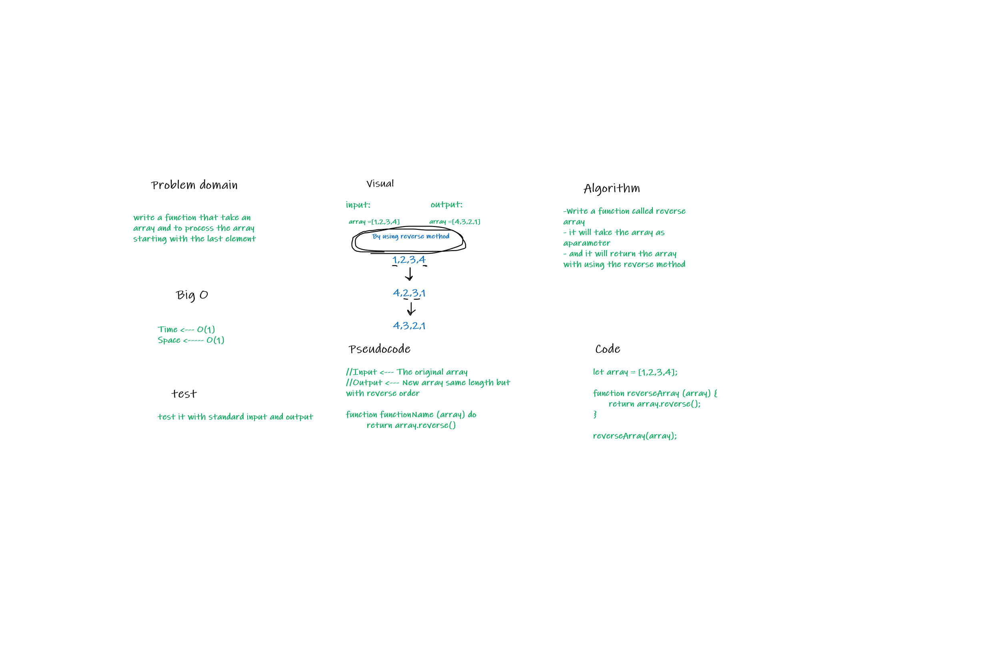

# Code challenge 1:

# Reverse an Array
<!-- Description of the challenge -->
- Write a function that take an array and to process the array starting with the last element

## Whiteboard Process
<!-- Embedded whiteboard image -->

## Approach & Efficiency
<!-- What approach did you take? Discuss Why. What is the Big O space/time for this approach? -->
- I took the output input approach, it will show the result how it should be 
- Big O 
   - Time <--- O(1)
   - Space <----- O(1)